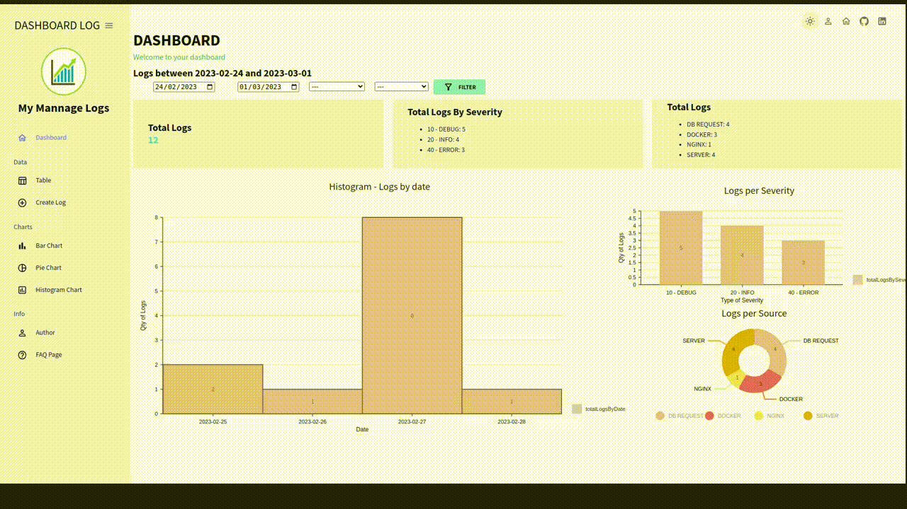
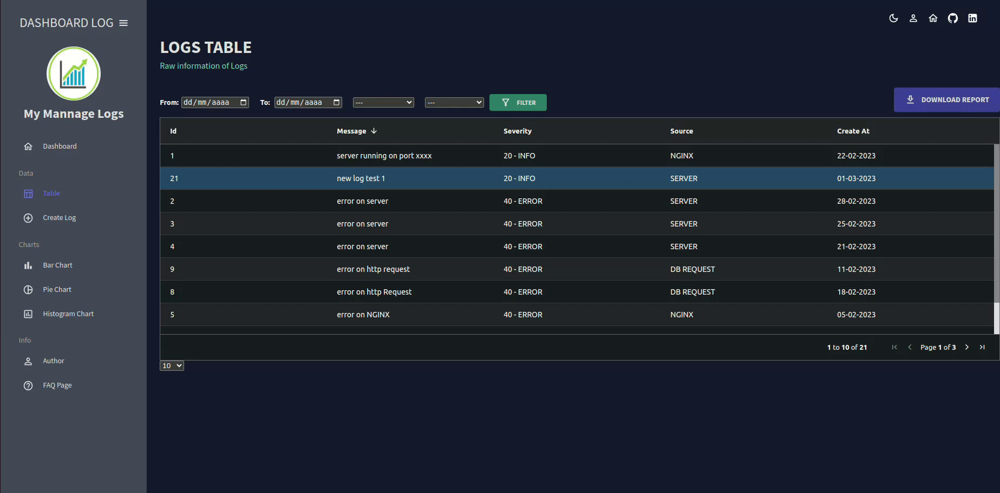
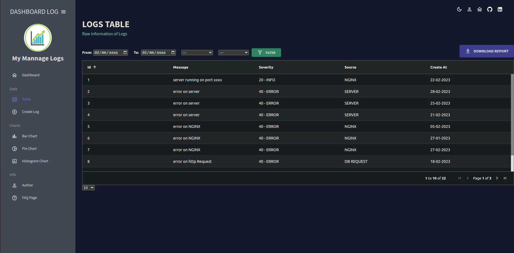
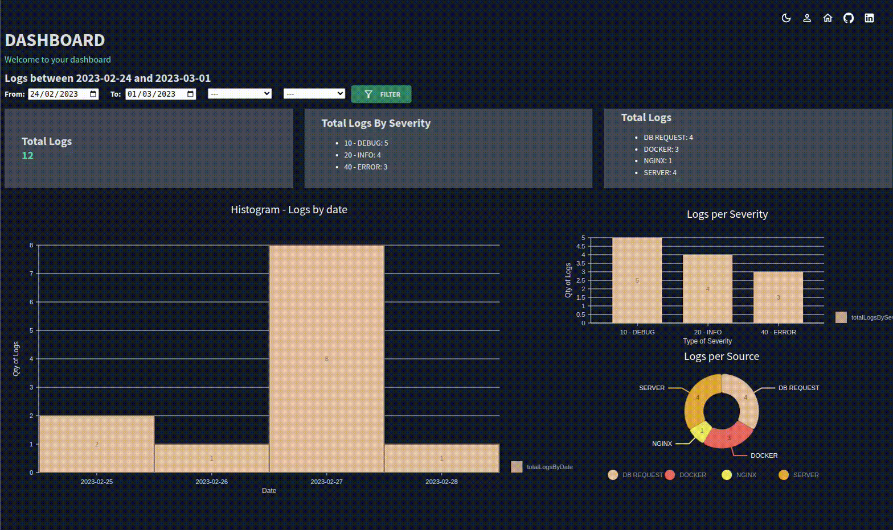
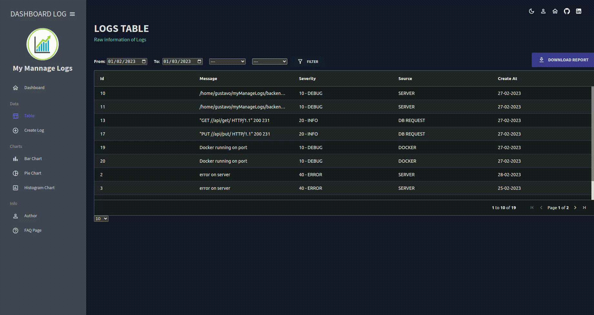

# My Manage Logs

## About the project

Full Stack project based on a Manage Logs.

The logs are a very important part of any enterprise. From this, we can access information to prevent or solve problems related to server, database, security or request.

This project contain 2 parts. These are:

+ Backend: The server was developed on ubuntu 22.04 and written on Django with its module Django Rest Framework.
  - CORS: The cross request are configurated with corsheaders middleware. 
  - Virtual Enviroment: Pipenv was used. This virtual enviroment manager is one the most powerfull tool currently.
  - Environ: This tool allow us to work with enviroment variables.
  - Database: For data persistence, the PostgreSql database was used. A database called crud is in charge of storing all the information about the logs.
  - psycopg2: is a driver for interacting with PostgreSQL
  - Test: In addition, you can find a simple test of the views and urls in Test folder.
  - MyManageLogs: Application inside the Django project. This is the heart of our project and has all the information about this.

+ The client was developed in React Js, using React-Query for better information interaction. In addition, different libraries were used for the construction of the project. 
  - Nivo: This library is in charge of creating charts.
  - Material Ui: allows us to develop the visual environment with a sophisticated and very friendly style.
  - Ag Grid: taking advantage of its table module for the creation and management of data.
  - React-Query: Very powerfull tool to manage state of our request to backend.
  - Formik: This library simplifies the way we work with forms.
  - Yup: Used to validate data of our forms.
  - Axios: In charge to make request to the server.
  - React-pro-sidebar: Used to do part of the style along with MUI library.


## Server Structure

Backend was developed in Python with Django Rest Framework. The database is made on postgre sql

Inside the backend folder you can find:

- config: files that make up the system configuration.
- mymanagelogs: The application itself. Here we can find views, serializer, models, etc. 
- test: quickly and simple view test.


[Django Information](https://www.djangoproject.com/).

[Django Rest Framework Information](https://www.django-rest-framework.org/).

[PostgreSQL Information](https://www.postgresql.org/).

**The files inside the folders are not showm in the tree bellow** 

```
Backend
 ┣ config
 ┃ ┣ __init__.py
 ┃ ┣ asgi.py
 ┃ ┣ settings.py
 ┃ ┣ urls.py
 ┃ ┗ wsgi.py
 ┣ logs
 ┃ ┗ managelogs.log
 ┣ mymanagelogs
 ┃ ┣ test
 ┃ ┣ admin.py
 ┃ ┣ apps.py
 ┃ ┣ custom_logging.py
 ┃ ┣ models.py
 ┃ ┣ serializers.py
 ┃ ┣ urls.py
 ┃ ┗ views.py
 ┣ .env
 ┣ Pipfile
 ┣ Pipfile.lock
 ┗ manage.py
```

## Client Structure

Client was developed in React Js, using React-Query and Axios Request to make petitions to the Server.
For the development of the views the Material UI and React Pro Sidebar library has been used 

[Mui Information](https://mui.com/).

[React-Query Information](https://react-query-v3.tanstack.com/).

[React Pro Sidebar Information](https://github.com/azouaoui-med/react-pro-sidebar#readme).


It has a simple but well-defined structure regarding the task defined for each component.

You can find the following folders:
+ API
  - Dashboard
 
Contain the Axios Request from Client to Server.

+ Assets: Here you can find the different photos used in the website.

+ Components: components used inside the pages to help visualized the data. 

+ Context: 
  - ColorContext: Used for the theme.
  - DashboardContext: Information used in the dashboard.

The context are a very common way to pass information between the different components in React.

+ Hooks: Custom hook used in the theme.

+ Layout: The project has 2 layouts. One of them for the home page and the other for the dashboard.

+ Pages: Represent the different sections of the web.

+ Settings: Configuration about the project.

+ Keys: React-Query is used to do the different Request to the Server. React-Query need keys to make these request. In this folder you can find all the keys used inside the project.

+ Routes: Routes used with React Router Dom.

+ Utils: Different utilities that help us with our project.

**The files inside the folders doesn't show bellow**
```

frontend                               
├─ public                              
├─ src                                 
│  ├─ Keys                             
│  ├─ api                              
│  ├─ assets                           
│  ├─ components                       
│  │  ├─ Box                           
│  │  ├─ Carousel                      
│  │  ├─ Containers                    
│  │  │  ├─ createlog                  
│  │  │  │  └─ CreateLogContainer.jsx  
│  │  │  ├─ dashboard                  
│  │  │  ├─ logdetail                  
│  │  │  └─ table                      
│  │  ├─ Header                        
│  │  ├─ charts                        
│  │  ├─ filterPanel                   
│  │  ├─ global                        
│  │  ├─ table                         
│  │  └─ index.js                      
│  ├─ context                          
│  │  ├─ ColorContext                  
│  │  ├─ DashboardContext              
│  │  └─ index.js                      
│  ├─ hooks                            
│  │  ├─ Theme                         
│  ├─ layout                           
│  ├─ pages                            
│  │  ├─ Home                          
│  │  ├─ charts                        
│  │  ├─ createlog                     
│  │  ├─ dashboard                     
│  │  ├─ logdetail                     
│  │  ├─ table                         
│  │  └─ index.js                      
│  ├─ routes                           
│  │  ├─ DashBoardRoutes               
│  │  ├─ Home                          
│  │  └─ index.js                      
│  ├─ settings                         
│  ├─ utils                            
│  │  ├─ DashboardUtils                
│  │  │  ├─ Charts                     
│  │  │  └─ Table                      
│  │  ├─ Date                          
│  │  ├─ table                         
│  │  └─ index.js                      
│  ├─ App.js                           
│  ├─ index.css                        
│  └─ index.js                         
├─ README.md                           
├─ package.json                        
├─ yarn-error.log                      
└─ yarn.lock                           

```


## Navegation

### Home

A nice welcome page where we will find some information about the project. Here we can find a button that will be redirectioned to the dashboard.


### Dashboard

We can find 3 sections throughout the project

+ Dashboard:
This panel is very frinedly and dynamic.
This section has 3 charts: 
  - Pie Chart: In this chart we can find the logs by source. How many logs were produced in each source.
  - BarChart: Makes a corelation between the quantity of logs and their severity.
  - Histogram: In this chart we can observe the number of the logs per day. 


+ Data: 
This secction contain a logs table.
  - Table: Here you can see all information of the logs. Severity, Source, Message and Date. Also, you can perform the next actions:
    - Sorting: You can sort the information making a simple click in the header of each column. Is posible to combine different sorts. 

    - Filtering: You can filter the logs by different parameters (Dara Range, Severity, Source). In addition, you can combine filters with sorts to get a most puntual information.

    - Edit a log: With a double click over the selected log, you will be redirected to a panel of this logs. From this panel you can modify the information of the logs. As default, the field input will be complete with the original parameter of the log (message, severity and source). You can erase this information and change it. In addition, here you will find a delete button to erase the log.

  - Create Log: Form for the creation of a new log.


+ Chart:
You can find the three charts shown in the dashboard but with a best resolution to appreciate the information in the best way.
If you modify the data range, severity, source or all of them in the dashboard, the information inside of this chart also will change.
Here we can find 3 charts.
 - Pie Chart
 - Histogram
 - Bar Chart


### Custom Theme
By default the theme of the dashboard is configured as "Dark", but you can change it from the header of the dashboard. Here you can find 4 icons. One of them is a moon, if you clicked here the theme will change to "Light" and the panel background will be white. Also, the color of the components will change. Now you will have a sun, if you click again, you will have the dark theme again.  Also you can collapse the sidebar.


### Custom Logger Configuration.
In the backend folder, in mymanagelogs sections there is a file that can be activated from settings file project.
This configurations allow us to save all the logs generated by the project in our database. In this way we can use it to complement our proyect if we want.


### Crud Database.
The database used in the project is included. In order to be used, you must import it in your postgresql.


## Dependencies

* Server side:
  - "asgiref":"3.6.0"
  - "django":"4.1.7"
  - "django-environ":"0.9.0"
  - "djangorestframework":"3.14.0"
  - "flake8":"6.0.0"
  - "mccabe":"0.7.0"
  - "psycopg2":"2.9.5"
  - "pycodestyle":"2.10.0"
  - "pyflakes":"3.0.1"
  - "pytz":"2022.7.1"
  - "sqlparse":"0.4.3"

* Client Side: 
  - "@emotion/react": "^11.10.6",
  - "@emotion/styled": "^11.10.6",
  - "@mui/icons-material": "^5.11.9",
  - "@mui/material": "^5.11.10",
  - "@mui/styles": "^5.11.11",
  - "@mui/x-data-grid": "^5.17.25",
  - "@nivo/bar": "^0.80.0",
  - "@nivo/core": "^0.80.0",
  - "@nivo/geo": "^0.80.0",
  - "@nivo/line": "^0.80.0",
  - "@nivo/pie": "^0.80.0",
  - "@testing-library/jest-dom": "^5.14.1",
  - "@testing-library/react": "^13.0.0",
  - "@testing-library/user-event": "^13.2.1",
  - "ag-grid-community": "^29.1.0",
  - "ag-grid-react": "^29.1.0",
  - "axios": "^1.3.4",
  - "formik": "^2.2.9",
  - "moment": "^2.29.4",
  - "react": "^18.2.0",
  - "react-dom": "^18.2.0",
  - "react-material-ui-carousel": "^3.4.2",
  - "react-pro-sidebar": "^0.7.1",
  - "react-query": "^3.39.3",
  - "react-router-dom": "^6.8.1",
  - "react-scripts": "5.0.1",
  - "styled-components": "^5.3.6",
  - "web-vitals": "^2.1.0",
  - "yup": "^1.0.1"


### `Scripts`
- Server
  - From the backend folder input python manage.py runserver

- Client 

## Available Scripts

In the project directory, you can run:

### `yarn start`

Runs the app in the development mode.\
Open [http://localhost:3000](http://localhost:3000) to view it in your browser.

The page will reload when you make changes.\
You may also see any lint errors in the console.

### `yarn test`

Launches the test runner in the interactive watch mode.\
See the section about [running tests](https://facebook.github.io/create-react-app/docs/running-tests) for more information.

### `yarn build`

Builds the app for production to the `build` folder.\
It correctly bundles React in production mode and optimizes the build for the best performance.

The build is minified and the filenames include the hashes.\
Your app is ready to be deployed!

See the section about [deployment](https://facebook.github.io/create-react-app/docs/deployment) for more information.

### `yarn eject`

**Note: this is a one-way operation. Once you `eject`, you can't go back!**

If you aren't satisfied with the build tool and configuration choices, you can `eject` at any time. This command will remove the single build dependency from your project.

Instead, it will copy all the configuration files and the transitive dependencies (webpack, Babel, ESLint, etc) right into your project so you have full control over them. All of the commands except `eject` will still work, but they will point to the copied scripts so you can tweak them. At this point you're on your own.

You don't have to ever use `eject`. The curated feature set is suitable for small and middle deployments, and you shouldn't feel obligated to use this feature. However we understand that this tool wouldn't be useful if you couldn't customize it when you are ready for it.


## Bellow you can see some actions in our page.

## Changing theme.


## Dashboard - Filter and charts


## Create a New Log.


## Delete Log.


## Edit Log.


## Dynamic Filter.


## Table - Filtering and Sorting.



## ENV DATA
Env data is included into the project.

